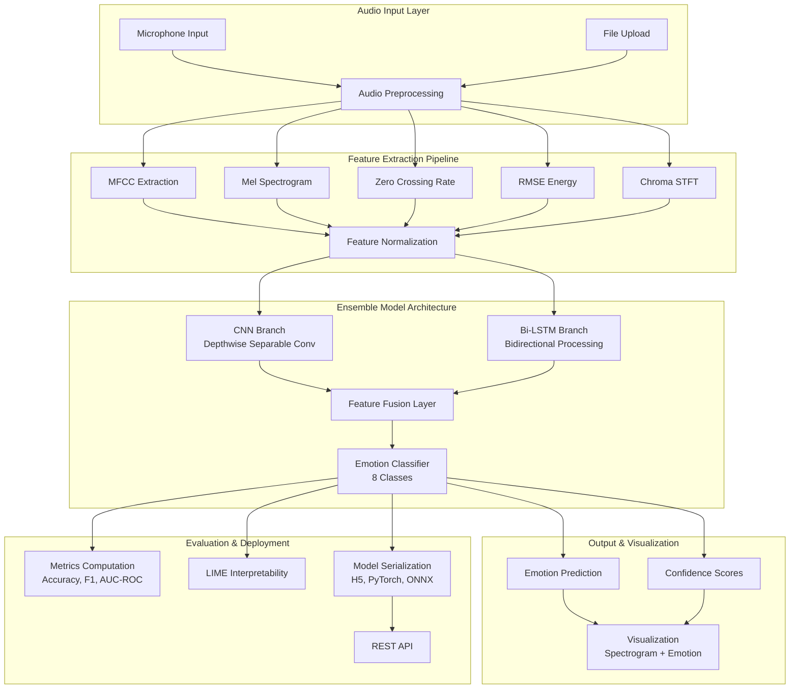
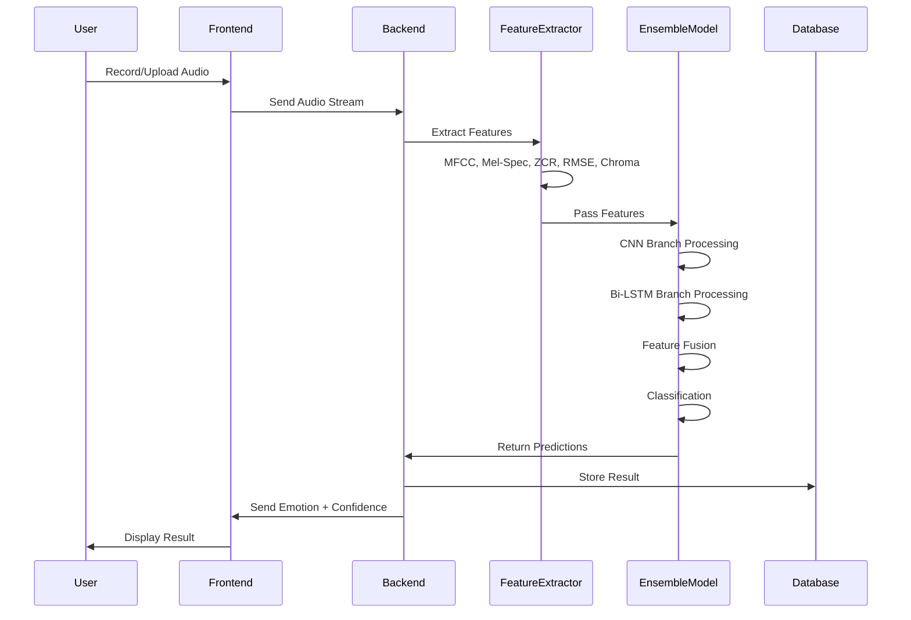
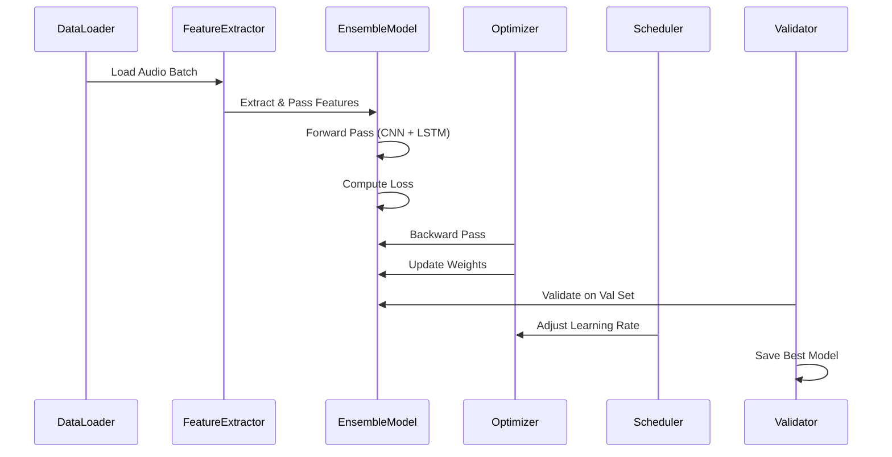

# Design Document: Enhanced Speech Emotion Recognition System

## Executive Summary (Non-Technical Overview)

### What This Project Does

Imagine if your phone could understand how you're feeling just by listening to your voice. This project builds exactly that—a system that listens to someone speak and automatically detects their emotion (happy, sad, angry, calm, etc.).

**In Simple Terms:**
- **Input**: Someone speaks a sentence into a microphone
- **Processing**: The system analyzes the sound patterns in their voice
- **Output**: The system says "This person sounds angry" or "This person sounds happy" with a confidence score

### Why It Matters

- **Mental Health**: Detect stress or depression in customer service calls
- **Accessibility**: Help people with speech disabilities communicate emotions
- **Entertainment**: Create more interactive games and virtual assistants
- **Safety**: Identify distressed callers in emergency services

### Current Status

- **Existing Model**: 94% accuracy on test data (emotion_model_group8.pth)
- **Dataset**: 7,356 audio samples from RAVDESS (8 emotions)
- **Team**: Asit Jain, Avinash Singh, Prashant Kumar Mishra

### What We're Improving

1. **Better Accuracy**: Combine two different AI approaches (CNN + LSTM) for more reliable predictions
2. **Faster Processing**: Use hand-crafted features to speed up analysis
3. **User-Friendly Interface**: Build a web app where anyone can test the system
4. **Easier Deployment**: Package the model so it works on phones, servers, and cloud platforms

---

## Overview

This document presents a comprehensive technical design for an enhanced Speech Emotion Recognition (SER) system that builds upon the existing CNN-based implementation (94% accuracy on RAVDESS test data). The enhancement incorporates an ensemble architecture combining CNN and Bi-LSTM models with hand-crafted audio features, implements a real-time frontend for voice input/emotion detection, and adds comprehensive evaluation and deployment capabilities.

The system targets improved accuracy beyond 94%, optimized model efficiency for edge deployment, and a user-friendly interface for real-time emotion recognition from speech. The design leverages research findings from "Speech emotion recognition with lightweight deep neural ensemble model using hand crafted features" and integrates with the existing Python-based TensorFlow/Keras codebase.

## Architecture Overview



## System Components

### 1. Audio Input & Preprocessing Module

**Purpose**: Capture and prepare audio data for feature extraction

**Interface**:
```python
class AudioInputHandler:
    def capture_microphone(duration: float, sample_rate: int = 22050) -> np.ndarray
    def load_audio_file(file_path: str, sample_rate: int = 22050) -> np.ndarray
    def preprocess_audio(waveform: np.ndarray) -> np.ndarray
```

**Responsibilities**:
- Real-time microphone capture with configurable duration
- Audio file loading (WAV, MP3, OGG formats)
- Noise removal using spectral gating or noise reduction algorithms
- Mono conversion (if stereo)
- Normalization to [-1, 1] range
- Resampling to standard sample rate (22050 Hz)

**Key Algorithms**:
- Noise reduction: Spectral subtraction or Wiener filtering
- Normalization: Peak normalization or RMS-based normalization

### 2. Feature Extraction Pipeline

**Purpose**: Extract both hand-crafted and learned features from audio

**Interface**:
```python
class FeatureExtractor:
    def extract_mfcc(waveform: np.ndarray, n_mfcc: int = 13) -> np.ndarray
    def extract_mel_spectrogram(waveform: np.ndarray, n_mels: int = 64) -> np.ndarray
    def extract_zcr(waveform: np.ndarray, frame_length: int = 2048) -> np.ndarray
    def extract_rmse(waveform: np.ndarray, frame_length: int = 2048) -> np.ndarray
    def extract_chroma_stft(waveform: np.ndarray, n_chroma: int = 12) -> np.ndarray
    def normalize_features(features: np.ndarray) -> np.ndarray
```

**Hand-Crafted Features**:

1. **MFCC (Mel-Frequency Cepstral Coefficients)**
   - Extracts 13 coefficients representing spectral characteristics
   - Mimics human auditory perception
   - Computed from mel-scale spectrogram

2. **Mel Spectrogram**
   - Time-frequency representation on mel scale
   - Dimensions: (n_mels=64, time_steps)
   - Converted to dB scale for better representation

3. **Zero Crossing Rate (ZCR)**
   - Measures frequency of sign changes in waveform
   - Indicator of noise and voicing characteristics
   - Computed per frame

4. **RMSE Energy**
   - Root Mean Square Energy per frame
   - Indicates loudness and energy variations
   - Useful for emotion intensity detection

5. **Chroma STFT**
   - 12-dimensional representation of pitch content
   - Aggregates energy across octaves
   - Captures harmonic characteristics

**Feature Normalization**:
- Standardization: (X - mean) / std
- Applied per feature type to ensure equal contribution
- Computed on training set, applied to test/inference data

### 3. Ensemble Model Architecture

**Purpose**: Combine CNN and Bi-LSTM for robust emotion classification

#### 3.1 CNN Branch (Depthwise Separable Convolutions)

```python
class CNNBranch(nn.Module):
    def __init__(self, input_channels: int = 3, num_classes: int = 8):
        # Initial convolution: 7x7 kernels
        # Depthwise Separable Blocks:
        #   Block 1: 64 -> 128 channels
        #   Block 2: 128 -> 256 channels
        #   Block 3: 256 -> 512 channels
        # Global Average Pooling
        # Output: 512-dim feature vector
```

**Architecture Details**:
- Input: 3-channel mel-spectrogram (3, 64, T)
- Initial Conv: 7×7 kernels, stride=2, 64 filters
- Depthwise Separable Blocks:
  - Depthwise: Groups=input_channels (spatial filtering)
  - Pointwise: 1×1 convolution (channel mixing)
  - BatchNorm + ReLU after each
  - MaxPooling for spatial reduction
- Global Average Pooling: Reduces to (512,)
- Output: 512-dimensional feature vector

**Advantages**:
- Reduced parameters vs standard convolutions
- Efficient computation for edge deployment
- Maintains discriminative power for emotion classification

#### 3.2 Bi-LSTM Branch

```python
class BiLSTMBranch(nn.Module):
    def __init__(self, input_size: int, hidden_size: int = 128, num_layers: int = 2):
        # Bi-directional LSTM layers
        # Forward and backward context capture
        # Output: Concatenated hidden states
```

**Architecture Details**:
- Input: Sequence of hand-crafted features (T, feature_dim)
- Bi-LSTM Layer 1: 128 hidden units, bidirectional
- Bi-LSTM Layer 2: 128 hidden units, bidirectional
- Output: (T, 256) - concatenation of forward and backward
- Final: Take last hidden state (256,)
- Output: 256-dimensional feature vector

**Advantages**:
- Captures temporal dependencies in both directions
- Effective for sequential audio features
- Complements CNN's spatial feature extraction

#### 3.3 Feature Fusion & Classification

```python
class EnsembleClassifier(nn.Module):
    def __init__(self, cnn_feat_dim: int = 512, lstm_feat_dim: int = 256, num_classes: int = 8):
        # Concatenate CNN and LSTM features
        # Fusion layer: (512 + 256) -> 256
        # Classification layers: 256 -> 128 -> 8
```

**Fusion Strategy**:
- Concatenate CNN features (512) and LSTM features (256)
- Fusion layer: 768 -> 256 with ReLU activation
- Dropout (0.5) for regularization
- Classification head: 256 -> 128 -> 8 (emotions)
- Output: Softmax probabilities for 8 emotion classes

**Regularization Techniques**:
- Dropout: 0.5 rate in fusion and classification layers
- Batch Normalization: After each dense layer
- L2 regularization: Weight decay = 1e-4
- Early stopping: Monitor validation loss

### 4. Training Pipeline

**Purpose**: Train ensemble model with optimization and regularization

**Training Configuration**:
```python
class TrainingConfig:
    batch_size: int = 32
    num_epochs: int = 100
    learning_rate: float = 0.001
    weight_decay: float = 1e-4
    dropout_rate: float = 0.5
    
    # Learning rate scheduling
    scheduler_type: str = "ReduceLROnPlateau"
    scheduler_factor: float = 0.5
    scheduler_patience: int = 5
    
    # Data split
    train_split: float = 0.66
    val_split: float = 0.34
    stratified: bool = True
```

**Training Loop**:
1. Load and preprocess RAVDESS dataset
2. Extract features for all samples
3. Create stratified train/validation split
4. Initialize ensemble model
5. For each epoch:
   - Forward pass through CNN and LSTM branches
   - Compute cross-entropy loss
   - Backward pass and gradient update
   - Validation evaluation
   - Learning rate adjustment
6. Save best model based on validation loss
7. Evaluate on test set (Actors 20-24)

**Loss Function**:
- Cross-Entropy Loss with class weights (optional for imbalanced emotions)
- Weighted loss: w_i = 1 / (class_frequency_i)

**Optimizer**:
- Adam optimizer with learning rate 0.001
- Momentum: β1=0.9, β2=0.999
- Weight decay: 1e-4 for L2 regularization

**Learning Rate Scheduler**:
- ReduceLROnPlateau: Reduce LR by factor 0.5 if validation loss plateaus
- Patience: 5 epochs without improvement
- Minimum LR: 1e-6

### 5. Evaluation Framework

**Purpose**: Comprehensive assessment of model performance

**Metrics Computed**:
```python
class EvaluationMetrics:
    def compute_accuracy(predictions, labels) -> float
    def compute_precision_recall_f1(predictions, labels) -> Dict
    def compute_confusion_matrix(predictions, labels) -> np.ndarray
    def compute_auc_roc(probabilities, labels) -> float
    def compute_auc_prc(probabilities, labels) -> float
    def compute_per_emotion_metrics(predictions, labels) -> Dict
```

**Evaluation Datasets**:
1. **RAVDESS**: Primary dataset (7356 samples, 8 emotions)
   - Train: Actors 1-19
   - Test: Actors 20-24
   
2. **Cross-Dataset Validation**:
   - TESS (Toronto Emotional Speech Set)
   - SAVEE (Surrey Audio-Visual Expressed Emotion)
   - CREMA-D (Crowd-sourced Emotional Multimodal Actors Dataset)

**Metrics**:
- **Accuracy**: (TP + TN) / (TP + TN + FP + FN)
- **Precision**: TP / (TP + FP) per emotion
- **Recall**: TP / (TP + FN) per emotion
- **F1-Score**: 2 * (Precision * Recall) / (Precision + Recall)
- **AUC-ROC**: Area under ROC curve (one-vs-rest for each emotion)
- **AUC-PRC**: Area under Precision-Recall curve
- **Confusion Matrix**: Visualization of misclassifications

**Interpretability**:
- LIME (Local Interpretable Model-agnostic Explanations)
- Feature importance analysis
- Attention visualization for LSTM branch
- Saliency maps for CNN branch

### 6. Frontend Application

**Purpose**: Real-time voice input and emotion detection interface

**Technology Stack**:
- Frontend: React.js or Vue.js with Web Audio API
- Backend: Flask/FastAPI Python server
- Communication: WebSocket for real-time streaming

**Features**:
1. **Microphone Recording**
   - Real-time audio capture
   - Visual waveform display
   - Recording duration control
   - Noise level indicator

2. **File Upload**
   - Support for WAV, MP3, OGG formats
   - File validation and size limits
   - Progress indicator

3. **Emotion Display**
   - Predicted emotion with confidence score
   - Confidence bar chart for all 8 emotions
   - Color-coded emotion representation
   - Emotion intensity indicator

4. **Visualization**
   - Mel-spectrogram display
   - Waveform visualization
   - Feature importance heatmap
   - Emotion probability distribution

5. **User Interface**
   - Clean, intuitive design
   - Real-time feedback
   - History of predictions
   - Export results (CSV, JSON)

### 7. Model Serialization & Deployment

**Purpose**: Enable model deployment across platforms

**Serialization Formats**:
1. **PyTorch (.pth)**
   - Native format for PyTorch models
   - Preserves architecture and weights
   - Used for training and fine-tuning

2. **ONNX (Open Neural Network Exchange)**
   - Cross-platform format
   - Enables deployment on various runtimes
   - Supports quantization and optimization

3. **TensorFlow SavedModel**
   - TensorFlow native format
   - Includes model architecture and weights
   - Supports serving via TensorFlow Serving

4. **Quantized Models**
   - INT8 quantization for edge devices
   - Reduces model size by 4x
   - Minimal accuracy loss

**Deployment Targets**:
- Cloud: AWS Lambda, Google Cloud Functions, Azure Functions
- Edge: Mobile devices (iOS, Android), Raspberry Pi, Jetson Nano
- Server: Docker containers, Kubernetes

### 8. REST API Specification

**Purpose**: Interface for frontend and external applications

**Endpoints**:

```
POST /api/v1/predict
  Input: Audio file (multipart/form-data) or base64 encoded audio
  Output: {
    emotion: string,
    confidence: float,
    probabilities: {emotion: float},
    features: {feature_name: value},
    processing_time_ms: int
  }

POST /api/v1/predict-stream
  Input: WebSocket connection with audio chunks
  Output: Real-time emotion predictions

GET /api/v1/model-info
  Output: {
    model_version: string,
    accuracy: float,
    supported_emotions: [string],
    input_sample_rate: int
  }

POST /api/v1/batch-predict
  Input: Multiple audio files
  Output: Array of predictions

GET /api/v1/health
  Output: {status: "healthy", timestamp: string}
```

## Data Flow Diagrams

### Inference Pipeline



### Training Pipeline



## Correctness Properties

### Property 1: Feature Extraction Consistency
**Statement**: For identical audio input, feature extraction must produce identical output vectors.

**Formal Specification**:
```
∀ audio ∈ AudioSet:
  extract_features(audio) = extract_features(audio)
  ∧ ||extract_features(audio)|| > 0
```

**Test Approach**: Property-based testing with identical audio samples

### Property 2: Emotion Classification Validity
**Statement**: Model output must be valid probability distribution over 8 emotions.

**Formal Specification**:
```
∀ audio ∈ AudioSet:
  let predictions = model.predict(audio)
  ∀ i ∈ [0, 7]: 0 ≤ predictions[i] ≤ 1
  ∧ Σ(predictions) = 1.0 (within floating-point tolerance)
  ∧ argmax(predictions) ∈ [0, 7]
```

**Test Approach**: Assertion checks on model output

### Property 3: Model Determinism
**Statement**: Model inference must be deterministic (same input → same output).

**Formal Specification**:
```
∀ audio ∈ AudioSet:
  model.predict(audio, seed=42) = model.predict(audio, seed=42)
```

**Test Approach**: Multiple inference runs with fixed random seed

### Property 4: Feature Normalization Bounds
**Statement**: Normalized features must be within expected bounds.

**Formal Specification**:
```
∀ features ∈ FeatureSet:
  let normalized = normalize(features)
  ∀ i: |normalized[i]| ≤ 3.0  (within 3 standard deviations)
```

**Test Approach**: Statistical validation on normalized features

### Property 5: Ensemble Fusion Correctness
**Statement**: Fused features must preserve information from both branches.

**Formal Specification**:
```
∀ cnn_feat, lstm_feat:
  let fused = fusion(cnn_feat, lstm_feat)
  ||fused|| > 0
  ∧ dim(fused) = dim(cnn_feat) + dim(lstm_feat)
```

**Test Approach**: Dimension and non-zero checks

## Error Handling Strategy

### Error Scenarios

1. **Invalid Audio Input**
   - Condition: Audio file corrupted or unsupported format
   - Response: Return HTTP 400 with error message
   - Recovery: Prompt user to upload valid audio file

2. **Feature Extraction Failure**
   - Condition: Audio too short or contains only silence
   - Response: Return HTTP 422 with specific error
   - Recovery: Request longer audio sample

3. **Model Inference Error**
   - Condition: Model weights not loaded or corrupted
   - Response: Return HTTP 500 with error message
   - Recovery: Restart service and reload model

4. **Out-of-Memory**
   - Condition: Batch size too large for available GPU/CPU
   - Response: Return HTTP 503 Service Unavailable
   - Recovery: Reduce batch size or queue request

5. **Network Timeout**
   - Condition: WebSocket connection lost during streaming
   - Response: Gracefully close connection
   - Recovery: Reconnect and resume from last checkpoint

## Testing Strategy

### Unit Testing
- Test individual components: feature extractors, model layers, metrics
- Mock external dependencies
- Coverage target: >90%

### Property-Based Testing
- Use Hypothesis (Python) for property-based tests
- Generate random audio samples and verify properties
- Test edge cases: silence, noise, extreme frequencies

### Integration Testing
- Test end-to-end pipeline: audio → features → prediction
- Test API endpoints with various inputs
- Test database interactions

### Cross-Dataset Validation
- Evaluate on TESS, SAVEE, CREMA-D datasets
- Measure generalization across different speakers/recording conditions
- Identify dataset-specific biases

### Performance Testing
- Measure inference latency (target: <500ms per sample)
- Measure throughput (target: >10 samples/sec on GPU)
- Memory profiling for edge deployment

## Performance Considerations

### Inference Latency
- Target: <500ms per audio sample (3-5 seconds)
- Optimization: Model quantization, batch processing, GPU acceleration

### Model Size
- Current CNN: ~5-10 MB
- Ensemble with LSTM: ~15-20 MB
- Quantized: ~5 MB (INT8)
- Target for edge: <10 MB

### Memory Requirements
- GPU: 2-4 GB VRAM for batch processing
- CPU: 1-2 GB RAM for inference
- Edge device: <500 MB RAM

### Throughput
- GPU: 50-100 samples/sec
- CPU: 5-10 samples/sec
- Edge: 1-2 samples/sec

## Security Considerations

### Data Privacy
- Audio files not stored permanently
- Temporary files deleted after processing
- HTTPS for all API communications
- User consent for data collection

### Model Security
- Model weights encrypted at rest
- API authentication (API keys, OAuth)
- Rate limiting to prevent abuse
- Input validation and sanitization

### Adversarial Robustness
- Test against adversarial audio examples
- Implement input perturbation detection
- Monitor prediction confidence for anomalies

## Dependencies

### Python Libraries
- PyTorch: Deep learning framework
- TorchAudio: Audio processing
- Librosa: Audio feature extraction
- NumPy, SciPy: Numerical computing
- Scikit-learn: Machine learning utilities
- Flask/FastAPI: Web framework
- LIME: Model interpretability

### External Services
- RAVDESS Dataset: Audio data
- Cloud storage: Model checkpoints
- Monitoring: Prometheus, ELK stack

### Hardware
- GPU: NVIDIA CUDA-capable (optional, for training)
- CPU: Multi-core processor
- Storage: 50 GB for datasets, 1 GB for models

## Implementation Roadmap

### Phase 1: Model Enhancement (Weeks 1-3)
- Implement Bi-LSTM branch
- Integrate hand-crafted features
- Train ensemble model
- Achieve >95% accuracy on RAVDESS

### Phase 2: Frontend Development (Weeks 4-6)
- Build React frontend with Web Audio API
- Implement microphone recording
- Create emotion visualization
- Deploy backend API

### Phase 3: Evaluation & Optimization (Weeks 7-9)
- Cross-dataset validation
- Model quantization and compression
- Performance benchmarking
- LIME interpretability analysis

### Phase 4: Deployment (Weeks 10-12)
- Docker containerization
- Cloud deployment (AWS/GCP)
- Edge device optimization
- Documentation and user guide

## Conclusion

This design provides a comprehensive blueprint for enhancing the Speech Emotion Recognition system with ensemble learning, real-time frontend capabilities, and production-ready deployment infrastructure. The combination of CNN and Bi-LSTM with hand-crafted features addresses the limitations of single-model approaches while maintaining computational efficiency for edge deployment.

The modular architecture enables independent development and testing of components, while the comprehensive evaluation framework ensures robustness across diverse datasets and use cases.
